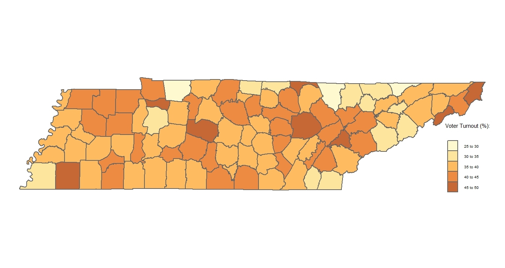

# Executive Summary
The purpose of this report is to give the client in-depth insight into the various processes we went through throughout creating this project. This report will cover our purpose for this research project, the methods we used, what we did with the data, the data analysis, key findings, figures, and what we've concluded from all the data we've compiled. With our findings, we will be able to help many with the task of combating disenfranchisement. 

# Introduction

An estimated 450,000 to 470,000 individuals in TN are being denied their right to vote due to incarceration, disproportionately affecting African American voters. Our purpose is to determine how many individuals are disenfranchised, specifically in each county in the state of Tennessee. 

# Methods

In order to make our findings most useful for policymakers and legislators, we used `RMarkdown` to create a written report with our findings for Dr. Sekou Franklin. Our analysis consisted of making choropleths to visualize trends as well as creating charts and tables, which is the most suitable format for  legislators and policy makers.  

### Data Acquisition
There is no standardized tracking system in place that houses county-level data on the number of disenfranchised individuals who are eligible to restore their voting rights. To circumvent this roadblock, we obtained an estimate of the number of people impacted by county and how it affects local elections by scouring the internet. We performed web scraping, data cleaning, and data exploration to obtain the appropriate datasets. 

### Data Provenance
Our data comes from the following sources:

**2019 Crime Data from the Federal Bureau of Investigation (FBI):** 
This dataset provides information on crime rates and types of crimes reported across different regions, which is essential for understanding the context of criminal justice and its implications on disenfranchisement.

**2022 Election Data from the Secretary of State:** 
This dataset includes election-related data such as voter turnout, election results, and voter registration statistics. It helps in analyzing the electoral process and its outcomes, especially in relation to disenfranchisement.

**Original Data on County Parties from the County Mayor’s Office:**
This dataset includes political party affiliations, voter demographics, and  information related to political organizations or groups within counties. It aids in understanding the political landscape and partisan dynamics affecting disenfranchisement.

**2022 State and Countywide Incarceration Data from the TN Department of Corrections:**
This dataset contains information on the number of incarcerated individuals at state and county levels in Tennessee. It is crucial for analyzing the impact of incarceration rates on disenfranchisement.

**2022 Demographic Data from the Census:**
This dataset provides demographic information such as population demographics, socioeconomic status, and racial demographics. It helps in understanding the demographic composition of areas affected by disenfranchisement.

### Dataset Merging

We merged relevant datasets to create original ones, enabling us to approach our question from a fresh perspective beyond providing a single numerical answer. We merged the voter turnout data with the census data to analyze what demographics might influence voter turnout by county. 

The datasets used in the No Vote No Voice: TN Disenfranchisement Project, analyzes the relationships between incarceration rates, demographic factors, election outcomes, and disenfranchisement across counties in Tennessee. To achieve this, the project merges Census data, FBI crime statistics, and corrections datasets. This integration allows for a comprehensive analysis that considers demographic profiles, crime rates, and the impact of incarceration on voting rights across different counties in Tennessee.

# Analysis

## Key Findings
We built the Tennessee county map (see Figure 1) to illustrate the patterns in the voter turnout and compare with the demographics of each county. Then, we charted the incarceration rate by felony type (see Figure 2) to get an estimate of the ratio of individuals who have the possibility of restoring their rights upon release versus those who do not. One of the most immediately apparent observations is that most people convicted of a felony are not due to violent crimes and thus could have their rights restored were it not for legal financial obligations (LFOs). 

Figure 1. 

This plot shows voter turnout rates. As you can see, the percentage only goes up to 50%. This is because Tennessee has one of the lowest voter turnout rates in the U.S.

Figure 2.

{width=50%}

This plot shows...

Figure 3.

{width=400%}

This plot shows that in the state of Tennessee, voter turnout by county varies from 29.3% to 48.4% and does not depend in a statistically significant way on the African American population or income level. On the other hand, it is important to note that very few counties have an African American population over ~20%. Although the African American Tennesseans make up only 17% of the state’s population, 40% of them are state prisoners. Additionally, the bar chart above visualizes that there are currently around 100,000 people incarcerated for felonies in the state of TN; the rest of the disenfranchised population have already served their time and have been released.

.jpg){width=70%}

This chart compares...

{width=90%} 

This map shows all Tennessee Counties and color codes them by low income counties and middle income counties (Teal being low income, yellow being middle).

# Key Takeaways

We found that there are 110,000 individuals currently incarcerated, while an estimated 300,000 individuals have been released from prison and may be eligible to regain their right to vote. There is a direct relationship between counties with high incarceration rates and low voter turnout. Counties with high incarceration rates have never exceeded 50 percent in voter turnout, contributing to Tennessee having the lowest voter turnout in the country.

# Conclusion
Although the data on disenfranchisement is bare, the impact of our research is substantial. Through the research process, we found that voter disenfranchisement is not discussed enough nor tracked enough. The findings will aid in raising awareness of the issue and the importance of thorough data collection. Additionally, our study highlights the disproportionate impact of disfranchisement on minority communities due to lack of representation by elected officials.