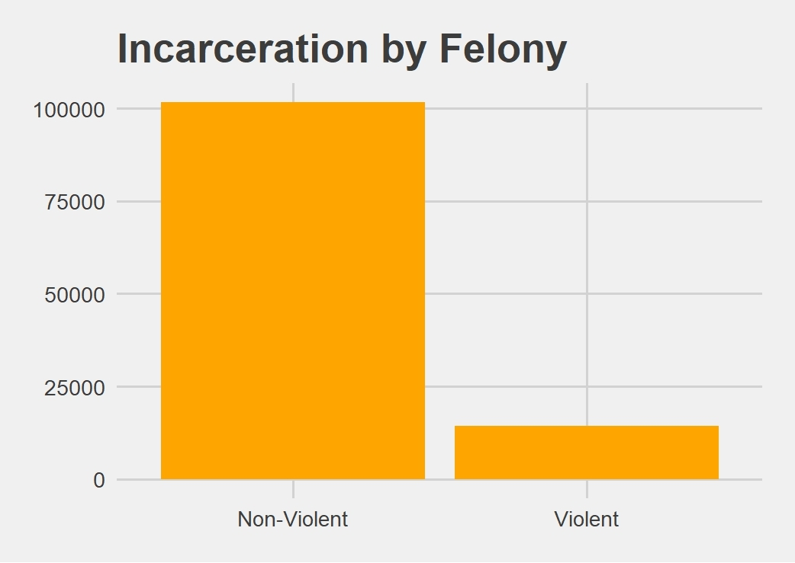

# Executive Summary
The purpose of this report is to give the client an deep insight into the various processes we went through throughout creating this project. This report will cover our purpose for this research project, the methods we used, what we did with the data, a data analysis key findings, figures, and what we've concluded from all the data we've compiled. With our findings, we will be able to help many with the task of combating disenfranchisement. 

# Purpose

An estimated 450,000 to 470,000 individuals in TN are being denied their right to vote due to incarceration, disproportionately affecting African American voters. Our purpose is to determine how many individuals are disenfranchised, specifically in each county in the state of Tennessee. 

## Methods

In order to make our findings most useful for policymakers and legislators, we used R Markdown to incorporate our findings into the final deliverable for Dr. Sekou Franklin, a written report. Our analysis consisted of mapping data using choropleths to visualize trends as well as charting findings in tables. The written report is the most suitable format for presentation to legislators and policy makers.  

### Data Acquisition
There is no standardized tracking system in place that houses county-level data on the number of disenfranchised individuals who are eligible to restore their voting rights. To circumvent this roadblock, we obtained an estimate of the number of people impacted by county and how it affects local elections. Then, we performed web scraping, data cleaning, and data exploration with visualizations to illustrate our findings. 

### Dataset Merging
We merged relevant datasets to create original ones, enabling us to approach our question from a fresh perspective beyond providing a single numerical answer. We merged the voter turnout data with the census data to analyze what demographics might influence voter turnout by county. 

### Analysis
In order to make our findings most useful for policymakers and legislators, we used R Markdown to incorporate our findings into the final deliverable for Dr. Sekou Franklin, a written report. Our analysis consisted of mapping data using choropleths to visualize trends as well as charting findings in tables. The written report is the most suitable format for presentation to legislators and policy makers.  

## Key Findings

We built the Tennessee county map (see Figure 1) to illustrate the patterns in the voter turnout and compare with the demographics of each county. Then, we charted the incarceration rate by felony type (see Figure 2) to get an estimate of the ratio of individuals who have the possibility of restoring their rights upon release versus those who do not. One of the most immediately apparent observations is that most people convicted of a felony are not due to violent crimes and thus could have their rights restored were it not for legal financial obligations (LFOs). 

Figure 1. 

this plot shows...

Figure 2.

{width=50%}
this plot shows...

Figure 3.

{width=400%}
this chart compares...

This plot shows that in the state of Tennessee, voter turnout by county varies from 29.3% to 48.4% and does not depend in a statistically significant way on the African American population or income level. On the other hand, it is important to note that very few counties have an African American population over ~20%. Although the African American Tennesseans make up only 17% of the state’s population, 40% of them are state prisoners. Additionally, the bar chart above visualizes that there are currently around 100,000 people incarcerated for felonies in the state of TN; the rest of the disenfranchised population have already served their time and have been released.

.jpg){width=70%}

This chart compares...

# Conclusion
Although the data on disenfranchisement is bare, the impact of our research is substantial. Through the research process, we found that voter disenfranchisement is not discussed enough nor tracked enough. The findings will aid in raising awareness of the issue and the importance of thorough data collection. Additionally, our study highlights the disproportionate impact of disfranchisement on minority communities due to lack of representation by elected officials.

# Implications
